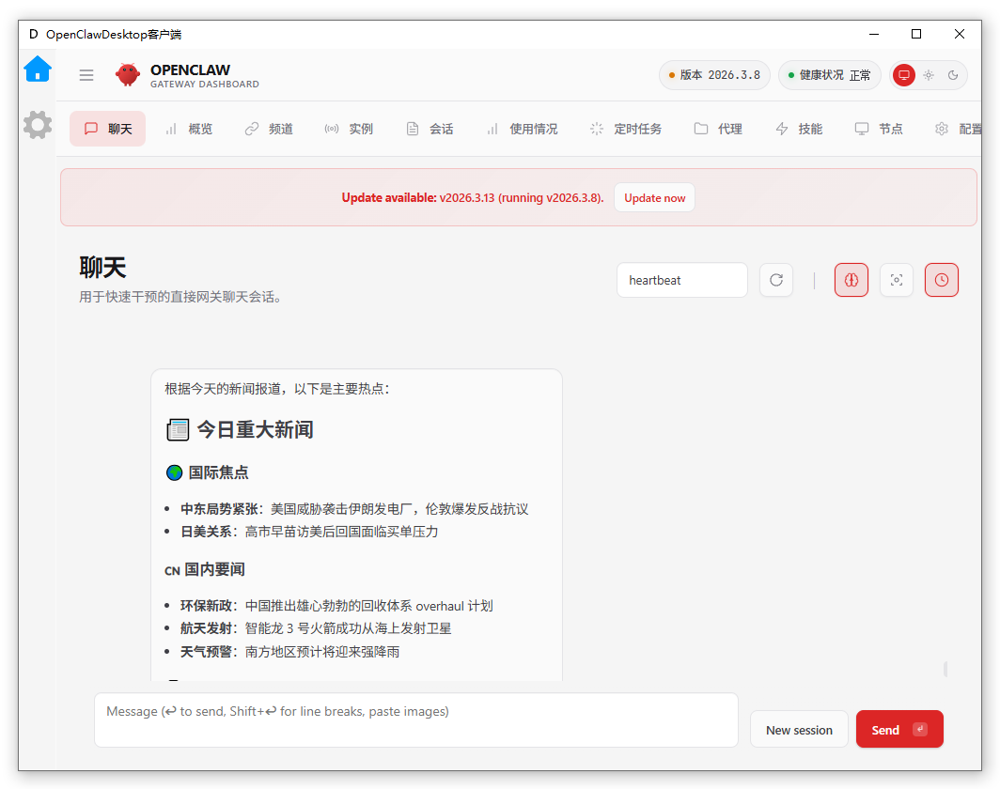
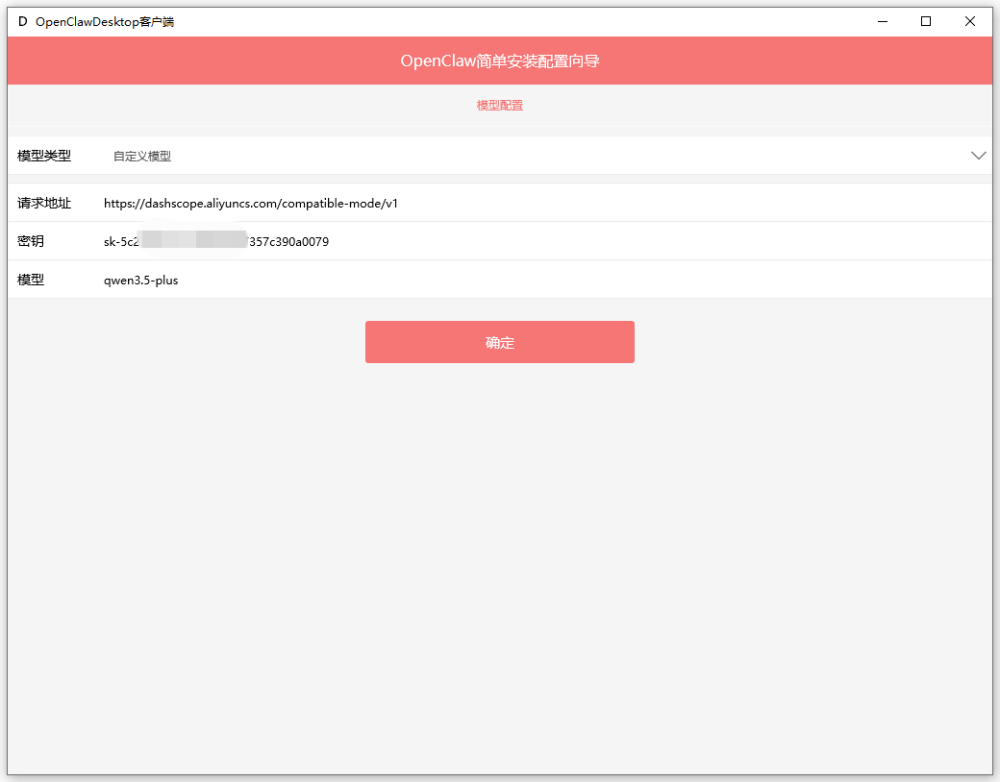
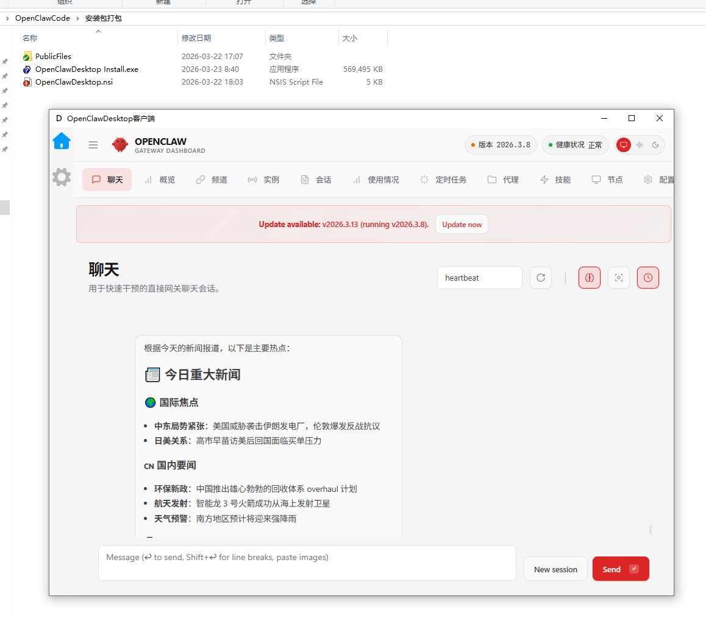

这是一个OpenClaw的桌面客户端应用程序，你可以打包一键安装包，可以直接安装运行来使用Openclaw，不需要使用官方的安装命令。    
    

  <a href="./README_en.md">English</a> |
  <a href="./README.md">简体中文</a> |

# 提供的功能    
1.自带绿色版的node和打包后的Openclaw的包，不需要手动安装openclaw。    
2.提供访问openclaw的客户端，不需要在浏览器中使用openclaw.    

# 编译打包的步骤
1.安装Delphi 13，或者其他版本    
2.打开工程组,安装OrangeUI组件    
3.编译客户端工程    
4.下载openclaw源码，打包openclaw到客户端\Win32\Debug\openclaw目录    
5.将绿色版node放在客户端\Win32\Debug\node目录    
6.运行客户端即可

# 使用步骤    
1.第一次运行会检测是否配置过openclaw，如果没有配置过，会有一个基本的模型配置页面    
    
2.配置过的话，会直接进入openclaw页面    
    

